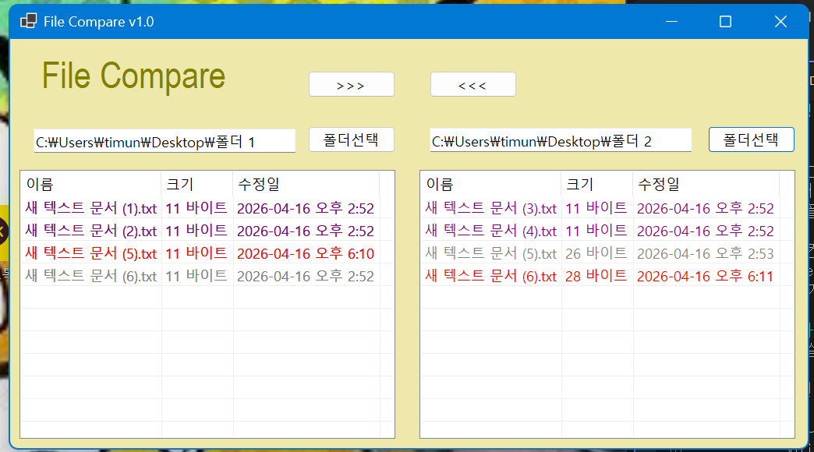
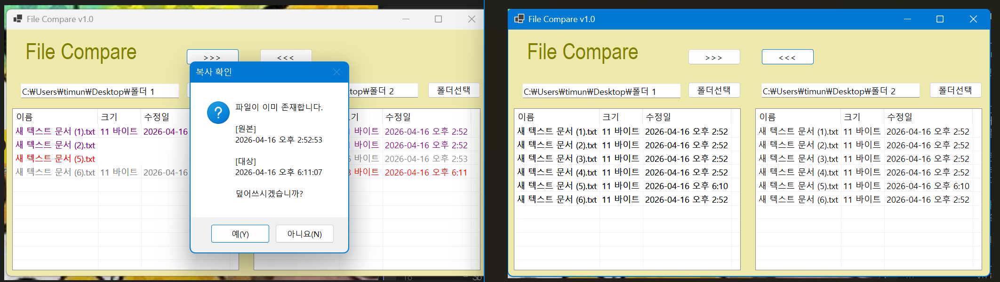

# (C# 코딩) File Compare

## 개요
- C# 프로그래밍 학습
- 1줄 소개: 사용자가 비교하고자 하는 두 폴더를 각각 선택하면 ListView를 통해 색상별로 구분된 비교 항목을 보여주는 프로그램
- 사용한 플랫폼
	- C#, .NET Windows, Visual Studio, Github
- 사용한 컨트롤
	- Label, TextBox, Button, SplitContainer, ListView, Panel
- 사용한 기술과 구현한 기능
	- SplitContainer, Panel, Label, TextBox, Button, ListView 컨트롤을 사용해 UI를 완성함.
	- Dock 속성을 설정해 SplitContainer에 Panel을 크기와 순서에 맞게 고정함.
	- Anchor 속성을 설정해 창 크기가 변해도 Label, TextBox, Button, ListView 각 컨트롤이 패널에 고정되도록 함.
	- FolderBrowserDialog를 사용해 사용자가 버튼을 통해 폴더를 선택할 수 있도록 파일 대화상자를 띄우도록 함.
	- 선택된 폴더의 내용을 리스트뷰에 보이도록 함.
	- 두 폴더의 내용(파일)을 비교해 특징별로 각각 다른 색상을 가지도록 함.
	- ListView의 DrawSubItem, DrawColumHeader, DrawItem 속성 이벤트를 활용해 각 tag에 따라 빨강, 보라, 검정색으로 구분되도록 나누기를 구현함.
	- Directory.EnumerateFiles() 함수로 파일을 조회하고 Directory.EnumerateDirectories() 함수로 하위 폴더를 조회함.
	- DirectoryInfo, FileInfo를 이용해 파일의 이름과 크기, 수정일을 불러옴.
	- 양쪽 폴더의 파일을 서로 복사할 수 있도록 함.
	- 복사 전 동일한 파일이 이미 있는 경우 수정된 날짜 정보를 MessageBox로 제공한 후 확인받아 사용자가 진행여부를 결정하도록 함.

## 실행 화면 (과제1)
- 코드의 실행 스크린샷과 구현 내용 설명

- 구현한 내용 (위 그림 참조)
	- SplitContainer -> Panel -> Label, TextBox, Button, ListView 순으로 컨트롤을 이용해 UI 구성을 마침.
	- Dock 속성을 설정해 SplitContainer에 Panel을 고정함.
	- Anchor 속성을 설정해 창 크기가 변해도 Label, TextBox, Button, ListView 각 컨트롤이 패널에 고정되도록 함.
	- FolderBrowserDialog를 사용해 사용자가 버튼을 통해 폴더를 선택할 수 있도록 대화상자를 띄우도록 함.

## 실행 화면 (과제2)
- 코드의 실행 스크린샷과 구현 내용 설명

- 구현한 내용 (위 그림 참조)
	- PopulateListView()를 생성하고 각각의 특징에 따른 파일에 item.tag를 달아 "SAME", "NEW", "OLD"로 나눔.
	- if-else문을 사용해 왼쪽과 오른쪽 폴더를 비교해 같은 이름의 파일 중 가장 최신에 수정된 파일에 "NEW"를, 나머지는 "OLD" tag를 갖도록 함.
	- ListView의 DrawSubItem, DrawColumHeader, DrawItem 속성 이벤트를 활용해 각 tag에 따라 빨강, 보라, 검정색으로 구분되도록 나누기를 구현함.
	- Directory.EnumerateFiles() 함수로 파일을 조회하고 Directory.EnumerateDirectories() 함수로 하위 폴더를 조회함.
	- DirectoryInfo, FileInfo를 이용해 파일의 이름과 크기, 수정일을 불러옴.
	- 

## 실행 화면 (과제3)
- 코드의 실행 스크린샷과 구현 내용 설명

- 구현한 내용 (위 그림 참조)
	- 사용자가 ListView 확인 후 폴더 안의 파일을 마우스로 선택 가능하도록 함.
	- btnCopyFromLeft와 btnCopyFromRight로 사용자가 폴더를 양쪽으로 복사할 수 있도록 함.
	- CopyFileWithConfirmation() 함수와 ListView.SelectedItems, File.Copy(), Path.Combine()을 이용해 복사 전 동일한 파일이 이미 있는 경우 수정된 날짜 정보를 MessageBox로 제공한 후 확인받아 사용자가 진행여부를 결정하도록 함.
	- 최종적으로 양쪽 폴더의 내용(파일)이 같아질 수까지 있도록 함.