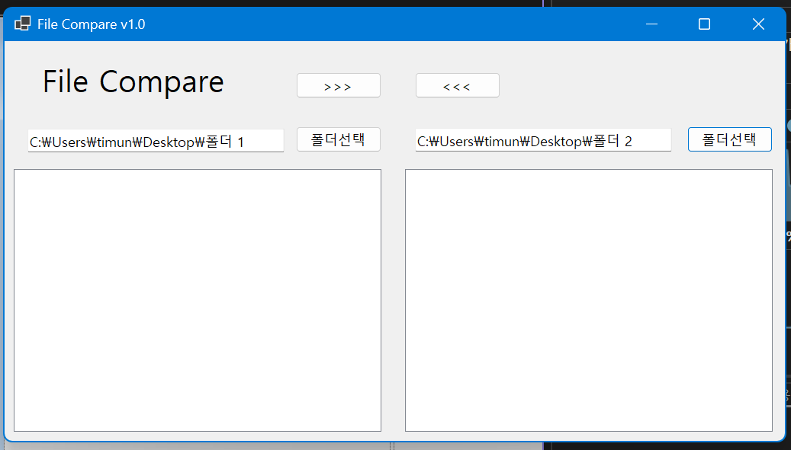

# (C# 코딩) File Compare

## 개요
- C# 프로그래밍 학습
- 1줄 소개: 사용자가 비교하고자 하는 두 폴더를 각각 선택하면 ListView를 통해 색상별로 구분된 비교 항목을 보여주는 프로그램
- 사용한 플랫폼
	- C#, .NET Windows, Visual Studio, Github
- 사용한 컨트롤
	- Label, TextBox, Button, SplitContainer, ListView, Panel
- 사용한 기술과 구현한 기능

## 실행 화면 (과제1)
- 코드의 실행 스크린샷과 구현 내용 설명

- 구현한 내용 (위 그림 참조)